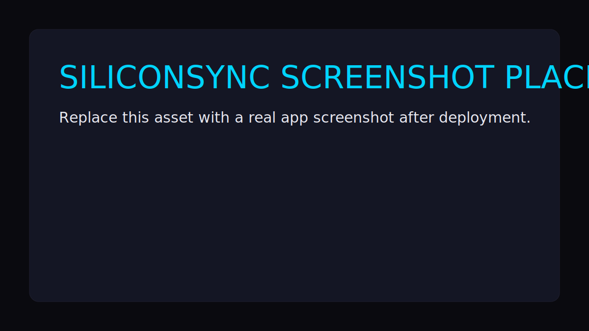

# SiliconSync - SiliconSync

SiliconSync is an automated daily tech news blog that publishes directly from this repository using GitHub Actions. Each run fetches technology stories from multiple free-tier sources, generates an editorial summary with Gemini, creates a themed SVG header image, and writes JSON + image assets into the repo.



## Project Overview

- Frontend: Vite + React + React Router
- Backend: Python 3.11+ + FastAPI
- AI model: Gemini `gemini-2.5-flash`
- Storage: Git-tracked JSON and SVG files only (no database)
- Automation: GitHub Actions (`daily-news.yml`, `cleanup.yml`)

## Repository Structure

```text
.
├── .github/workflows/
│   ├── daily-news.yml
│   └── cleanup.yml
├── backend/
│   ├── main.py
│   ├── news_fetcher.py
│   ├── summarizer.py
│   ├── image_generator.py
│   ├── publisher.py
│   ├── cleanup.py
│   ├── requirements.txt
│   └── tests/
├── frontend/
│   ├── src/
│   ├── public/
│   ├── package.json
│   └── vite.config.js
├── data/news/
├── assets/headers/
└── README.md
```

## Environment Variables

Set these in local `.env` and as GitHub repository secrets:

- `GEMINI_API_KEY` - Google AI Studio key: https://aistudio.google.com
- `NEWSAPI_KEY` - NewsAPI free tier key: https://newsapi.org
- `GNEWS_KEY` - GNews free tier key: https://gnews.io
- `MEDIASTACK_KEY` - MediaStack free tier key: https://mediastack.com (optional fallback source)
- `VITE_API_URL` - Backend URL used by frontend builds (optional locally)

## Local Development Setup

### Backend

1. Create and activate a Python virtual environment.
2. Install dependencies:

```bash
pip install -r backend/requirements.txt
```

3. Run FastAPI locally:

```bash
uvicorn backend.main:app --reload --port 8000
```

4. Run backend tests:

```bash
pytest backend/tests/
```

### Frontend

1. Install frontend dependencies:

```bash
cd frontend
npm install
```

2. Run frontend dev server:

```bash
npm run dev
```

3. Run frontend tests:

```bash
npm run test
```

The frontend defaults to `http://localhost:8000` for API calls if `VITE_API_URL` is unset.

## GitHub Secrets Setup

1. Go to repository `Settings` -> `Secrets and variables` -> `Actions`.
2. Add the following secrets:
	- `GEMINI_API_KEY`
	- `NEWSAPI_KEY`
	- `GNEWS_KEY`
	- `MEDIASTACK_KEY` (optional)

## Enable GitHub Pages

1. Build and publish the frontend output to a branch or artifact of your choice.
2. Open repository `Settings` -> `Pages`.
3. Select the deployment source and branch/folder (for example, `gh-pages` branch or `main` with prebuilt static assets).
4. Set `VITE_API_URL` in your build environment to the deployed backend URL.

## Pipeline Flow (Daily)

`daily-news.yml` runs at `01:30 UTC` (7:00 AM IST):

1. Checks out code and sets Python 3.11.
2. Installs backend dependencies.
3. Runs `python backend/publisher.py`.
4. `publisher.py`:
	- fetches and merges tech news from multiple providers,
	- deduplicates URLs,
	- summarizes with Gemini,
	- generates a date-based SVG header,
	- writes `data/news/YYYY-MM-DD.json` and updates `data/news/index.json`.
5. Workflow commits and pushes generated `data/` and `assets/` changes.

The process is idempotent per date: reruns overwrite that date's JSON/SVG entry instead of duplicating index rows.

## Cleanup Flow (Weekly)

`cleanup.yml` runs every Sunday at `02:00 UTC`:

1. Executes `python backend/cleanup.py`.
2. Deletes post JSON and header SVG files older than 90 days.
3. Rewrites `data/news/index.json` with retained entries.
4. Commits and pushes cleanup changes when needed.

## API Endpoints

- `GET /api/news` - latest post
- `GET /api/news/{date}` - date-specific post (`YYYY-MM-DD`)
- `GET /api/news/index` - descending index list for sidebar

All endpoints serve local JSON files only. No external API calls happen at request time.

## Manual Workflow Trigger

1. Open repository `Actions` tab.
2. Select `Daily Tech News` or `Cleanup Old News`.
3. Click `Run workflow`.

## Seed Data

This repository includes three seeded posts and matching header SVGs so the app renders immediately:

- `data/news/2026-04-06.json`
- `data/news/2026-04-05.json`
- `data/news/2026-04-04.json`
- `data/news/index.json`
- `assets/headers/2026-04-06.svg`
- `assets/headers/2026-04-05.svg`
- `assets/headers/2026-04-04.svg`